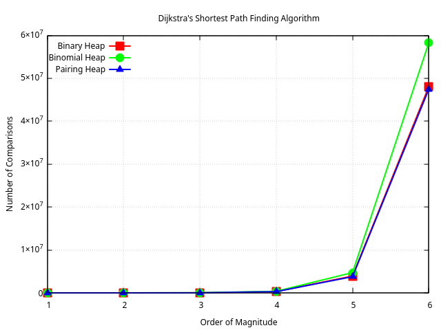
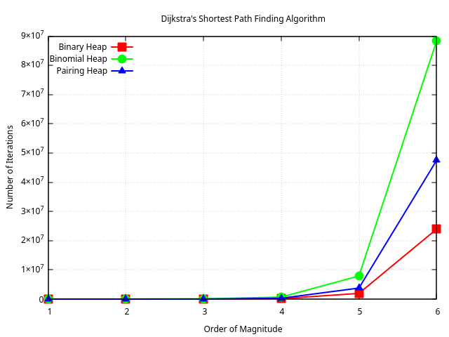
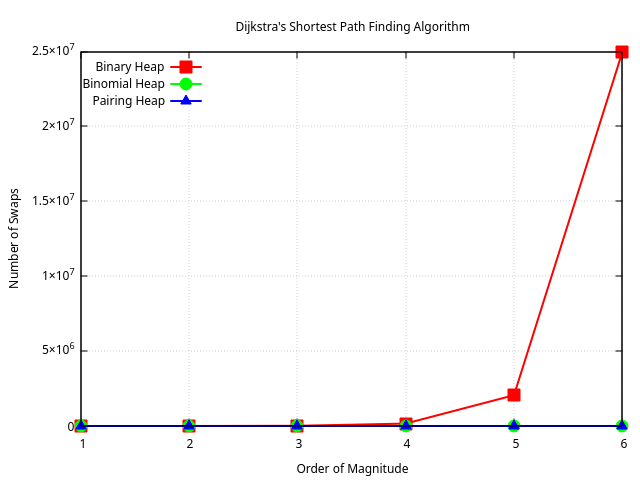
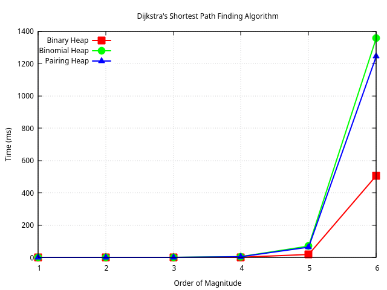

# Heaps Benchmark

Benchmarking three types of Heaps - Binary Heap, Binomial Heap, and Pairing Heap - per operation, in sorting and Dijkstra algorithms.

## Overview

**Some benchmark results from Dijkstra :**

  
